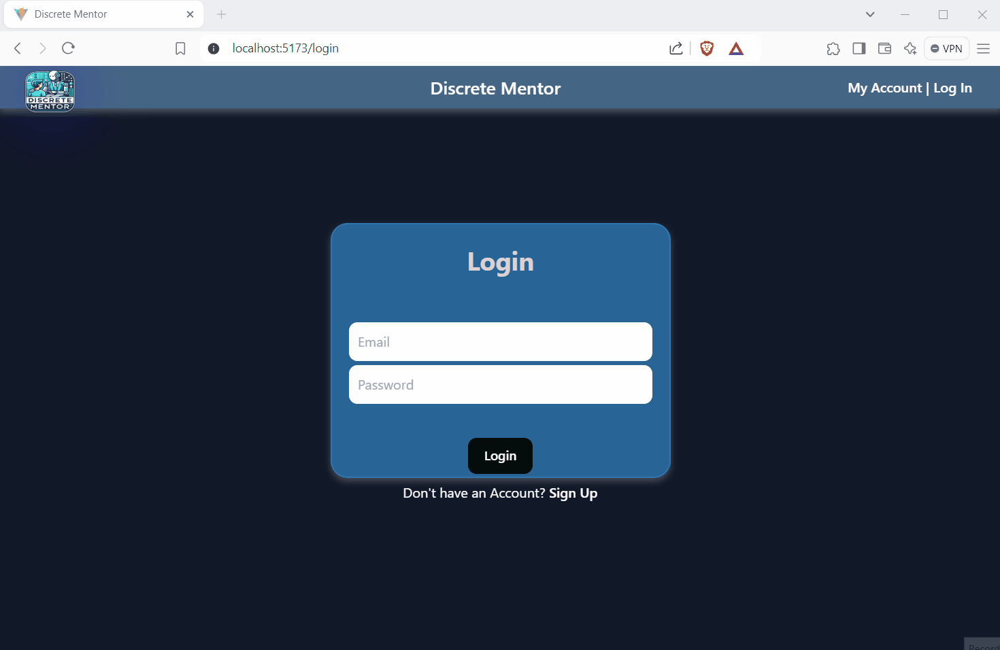
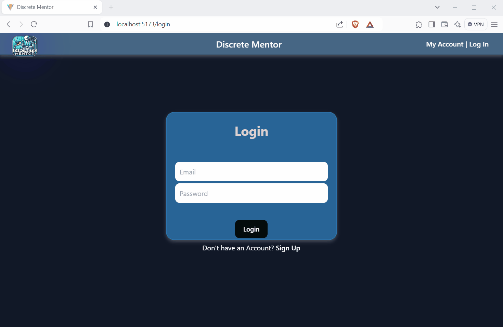
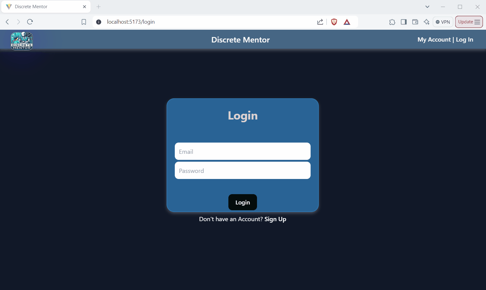
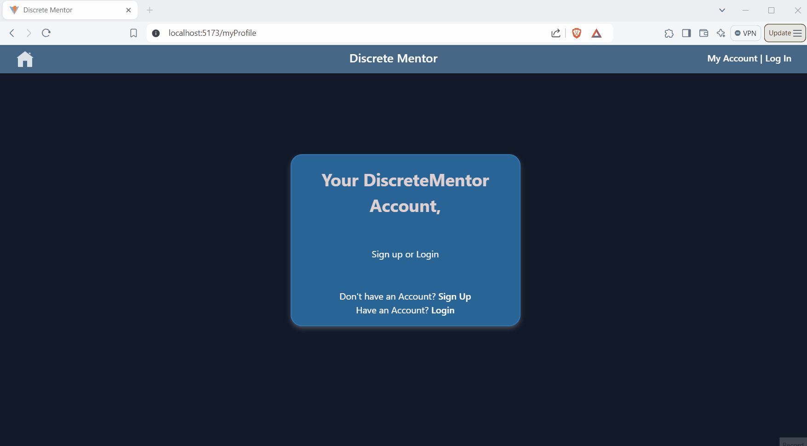
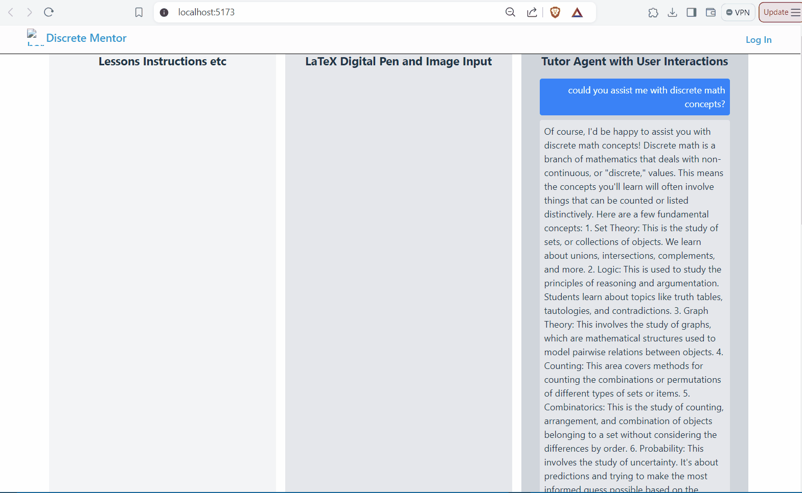

# Web Development Project - *DiscreteMentor*

## Live Application

The application is deployed and can be accessed at [Live Application](https://).

This web app: 

**DiscreteMentor is an AI-powered tutor designed to assist students in understanding and solving discrete mathematics problems. The main features of the application include:**  
  
**Interactive Lessons: Users can access lessons on discrete math topics and follow along with step-by-step explanations.**  
  
**AI Tutor Assistance: Users can input problems in LaTeX, image format, or using a digital pen, and the AI tutor provides guidance or feedback.**  
  
**Validation of Solutions: The AI Tutor Agent validates solutions and provides hints or corrections where necessary, ensuring users stay on topic and focus on discrete math.**  
  
**User Interface: The web app includes a 3-column layout for lessons, user input, and AI tutor interaction, built using React with Vite and Tailwind CSS**  
  
## Features

- [X] **Access to a variety of discrete math lessons and problems**
- [X] **Ability to input problems via LaTeX, image upload, or digital pen input**
- [X] **Interactive chat interface for AI tutor responses and guidance**
- [X] **Solution validation and error checking by the Math Validator Agent**
- [X] **Skill tracking to monitor user progress and suggest relevant problems**
- [X] **Responsive UI using a 3-column layout: lesson instructions, input area, and AI tutor response**
- [X] **Real-time API integration with OpenAI for advanced natural language processing and feedback**
  
## Tech Stack

**Frontend**: React, Tailwind CSS  
**Backend**: Node.js, Express.js, Axios  
**API**: OpenAI ChatGPT API, Supabase API,  
**Other**: Skill database, LaTeX parser for problem input  

## Video Walkthrough

 
  
  
  
  
  
  

## License

    All rights reserved.
